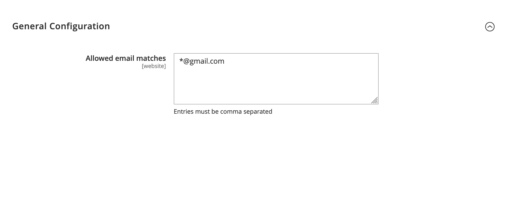

# Foobar

AdminSecurity is a standalone module for magento 2 that aims to
enforce stronger admin passwords and stricter policy for admin email.

## Installation

Use the package manager [composer](https://getcomposer.org) to install this module.

```bash
pip install prooxxy/adminsecurity
```

Make sure the module is enable before start using

```bash
php bin/magento module:enable PrOOxxy_AdminSecurity
```

## Usage

The module is enabled by default once installed.

### Passwords
Passwords will be enforced following all of these criterias:
1. must be at least 8 characters long
2. must have a number
3. must have at least one capital letter
4. must have one of the following characters: !@#$%?=*&

### Email adresses

Email enforcement can be configured by wildcard matches in
Stores -> configuration -> prooxxy -> adminsecurity



By default all email adresses are allowed but can be configured to only allow certain
domains names by configuring the allowed matches to be e.g

`*_*@company_name.com`  
or  
`*@company1.com, *@company2.com`

## License
[GPL-3.0](https://choosealicense.com/licenses/gpl-3.0/)
